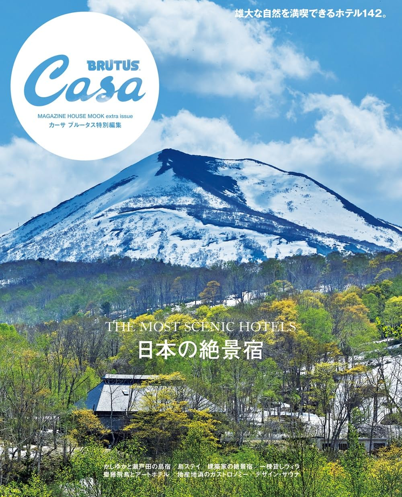

ゴールデンウィークで時間ができたので思いつきで書いてみた。毎年書いて振り返れるようにしたい。

### 01. Kubernetes の資格を取得

案件で本格的に使うことが予想されるので資格を取得しておきたい。今後の可能性を広げるためにも取っておきたい。

- Certified Kubernetes Administrator (CKA)
  - Kubernetes クラスターの構築・運用管理に関する実践的な知識を問う資格
- **Certified Kubernetes Application Developer (CKAD)**
  - Kubernetes を利用したアプリケーション開発に関する知識を問う資格
- **Certified Kubernetes Security Specialist (CKS)**
  - Kubernetes のセキュリティに特化した上級資格

### 02. TOEIC で英語学習の習慣をつくる

TOEIC をきっかけに*英語学習の習慣*をつくっていきたい。**目指せ 700 点！**

[TOEIC(R) L&R TEST ロジカル勉強地図](https://amzn.asia/d/4glkue6) という本を参考に学習計画を立てた。やることはシンプルなので後は淡々とこなすだけ。

### 03. AI 駆動開発を試す

今年は本格的に*AI を使いこなす年*にしたい。Devin などの AI エージェントを使った開発や MCP サーバーと連携した開発などを取り入れていきたい。興味があるのは以下。

- **Devin**
- **Claude Code**
- **Codex**

### 04. 海外旅行

数年行けていないので今年こそ行きたい。友達のいるドイツ、東南アジアで行ったことのないベトナムに行きたい。

### 05. 日本の絶景宿に行く

Casa の雑誌を買ってみた。

お高い宿が多かったけど、*星野リゾートの界*というブランドは行けそうなので行ってみたい。

## まとめ

来年また見返して振り返りたい。
