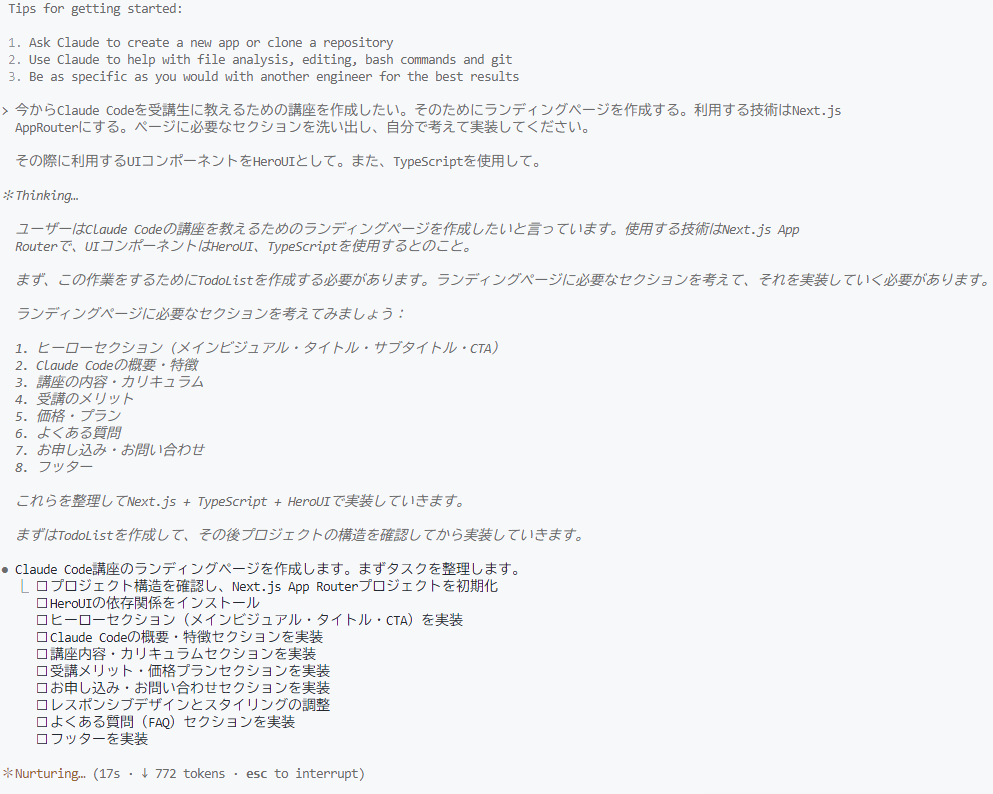
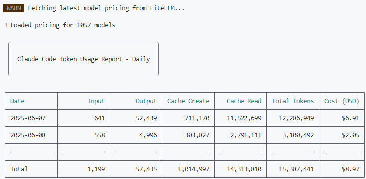

Anthropic からリリースされた**Claude Code**を試してみた。**Next.js**でランディングページを作成する過程で感じたことや気づいたポイントを記録しておく。

## Claude Code とは

Claude Code は、AI がコードを理解し、生成し、実際にプロジェクトを構築できるツールで、開発者の作業を大幅にサポートしてくれる**ターミナル型の AI 開発環境**である。

チャットベースでの指示により、プロジェクト構築からコードの生成、ビルド実行、デバッグ、Git 操作まで一連の開発作業を行うことができる。

## 作成したサイト

実際に作成したサイトはこちら。**Vercel**でデプロイした。

https://claude-code-landing.vercel.app/

## 環境セットアップ

### WSL のセットアップ

> [!IMPORTANT]
> Windows 環境では<abbr title="Windows Subsystem for Linux">WSL</abbr>上のみのサポートとなっているため、まず WSL を準備する必要がある。

```bash
wsl --install -d Ubuntu-24.04
```

### Node.js のインストール

権限管理とバージョン管理の観点から、nvm を使用して Node.js をインストールした。nvm を使うメリットは以下の通りである。

> [!TIP]
> 1. **sudo 不要**: ユーザー権限で Node.js の管理が可能
> 2. **バージョン管理**: 複数の Node.js バージョンの簡単切り替え
> 3. **セキュリティ**: 管理者権限を使わないため安全
> 4. **開発効率**: 権限エラーを気にせず開発が可能

WSL 環境で以下のコマンドを実行し、<abbr title="Node Version Manager">nvm</abbr>をインストールした。

```bash
# nvm のインストール
curl -o- https://raw.githubusercontent.com/nvm-sh/nvm/v0.40.3/install.sh | bash

# Node.js のインストール
nvm install --lts
nvm use node
# -> Now using node v22.16.0 (npm v10.9.2)
```

### Claude Code のインストール

```bash
npm install -g @anthropic-ai/claude-code
claude --version
```

> [!NOTE]
> インストール後、サブスクリプションプランである**Pro プラン**を選択してセットアップを完了した。これまで Max プランのみだったが、Pro プランでも利用できるようになっていた！

## 実際の開発体験

### プロジェクトの開始

ターミナルは**Cursor**上で Ubuntu 24.04 を立ち上げて使用した。

プロジェクトのディレクトリに移動してから `claude` コマンドを実行すると、そのディレクトリをベースとして作業が開始される。

```bash
cd path-to-dir
claude
```

Claude Code が生成したコードや回答を Cursor のコンテキストとして読み込ませることができるため、**非常にシームレスな開発体験**を得ることができた。

### 実装内容の指示

今回は以下のプロンプトでランディングページの作成を依頼した：

> Claude Code を受講生に教えるための講座を作成したい。そのためのランディングページを作成する。利用する技術は**Next.js App Router**とする。ページに必要なセクションを洗い出し、自分で考えて実装してください。
>
> その際に利用する<abbr title="User Interface">UI</abbr>コンポーネントは**HeroUI**とする。また、**TypeScript**を使用してください。

### 開発プロセス

Claude Code は以下のような流れで作業を進めた：

1. **要件分析**: ランディングページに必要なセクションの洗い出し
2. **技術選定**: Next.js App Router + HeroUI + TypeScript の構成
3. **プロジェクト構築**: 必要なファイルとディレクトリ構造の作成
4. **実装**: 各コンポーネントの作成
5. **エラー対応**: 発生したエラーの自律的な解決



### エラー対応

開発中にエラーが発生した際、Claude Code は自律的にエラーログを読み込み、対応策を考え、解決してくれた。

### デザインの改善

初期実装後、よりモダンなデザインへの改善を依頼した：

> よりモダンで洗練されたデザインにしてください。グラデーションやアニメーションなども充実させてください。

Claude Code はデザインの要求に対しても適切に対応し、CSS アニメーションや視覚効果を追加した洗練されたデザインに変更してくれた。

### パッケージの移行対応

UI ライブラリについて、Claude Code に HeroUI から**NextUI**への移行を依頼してみた。

問題なく適切にパッケージを移行してくれた。**パッケージ移行も自動的に対応できる点**は非常に便利だった。

## 完成までの時間とコスト

総合的な作業時間は約**1〜2 時間**ほどで、基本的なランディングページを作成することができた。

今回は Pro プランのため料金はかかっていないが、仮にプランに加入していない場合のコストを確認したいと思った。

そこで、非公式の Claude Code の使用料金を可視化する CLI ツール [ccusage](https://zenn.dev/ryoppippi/articles/6c9a8fe6629cd6) を使用した。

確認したところ、Total で$8.97 だった。

::github{repo="ryoppippi/ccusage"}



---

## 今後の展開

Claude Code を使った開発は以下の点で可能性を感じた：

> [!TIP]
> - **プロトタイプ作成の高速化**: アイデアを素早く形にできる
> - **学習ツールとしての活用**: 実装パターンを学ぶのに適している  
> - **デザインの試行錯誤**: 異なるデザインパターンを素早く試せる

<hr>

## まとめと考察

今回は、Claude Code を使って初めて**Vibe Coding（直感的で流れるような開発体験）**を試してみた。微妙な余白の調整なども的確に汲み取ってくれ、バグを伝えれば自律的に対応してくれる点が印象的だった。

この体験を通じて、**コーディングは AI、人間がレビューという開発体制**がすぐそこに来ていることを実感した。

Claude Code は特にプロトタイプ作成やアイデアの具現化における 0→1 のフェーズにおいて威力を発揮するため、まずは個人開発で積極的に取り入れていきたい。

ただし注意点もある。全く知識がないコードベースやフレームワークでは、セキュリティ上の問題点などを指摘できないため、本番リリースする際には十分な検証が必要だ。

今回はあまり馴染みのない Next.js を使用したが、内部で何が行われているのかが分からない状況は**精神的に不安**を感じた。ここで**基礎知識の重要性**を改めて実感することとなった。

結論として、AI が生成したコードを統合・レビューする立場にある人間には、従来以上に高いレビュー力が求められるのではないだろうか。**基礎知識と豊富な経験の重要性**は、AI 時代においても変わらないということを強く実感した。

## 参考動画

<iframe src="https://www.youtube.com/embed/6kBbbPDg12U?si=n6PxIpjnndZRMKTB" title="【Claude Code 入門】初心者 OK！誰でも爆速でアプリ開発ができる時代になりました" frameborder="0" allow="accelerometer; autoplay; clipboard-write; encrypted-media; gyroscope; picture-in-picture; web-share" allowfullscreen></iframe>

## 参考資料

- [Claude Code 公式ドキュメント](https://docs.anthropic.com/ja/docs/claude-code/overview)
- [Claude Code を Windows 上で使う方法 - Zenn](https://zenn.dev/acntechjp/articles/eb5d6c8e71bfb9)
- [nvm - Node Version Manager](https://github.com/nvm-sh/nvm)
- [Claude Pro（$20）プランでゼロから始める Claude Code - Zenn](https://zenn.dev/asap/articles/700168965fdb7b)
- [Claude Code の使用料金を可視化する CLI ツール「ccusage」を作った - Zenn](https://zenn.dev/ryoppippi/articles/6c9a8fe6629cd6)

---

:::warning
記事の作成に際して、以下の作業のみ AI で実施しました。
- 文章の誤字脱字の検知
- 読みやすい文章への変換
- Markdown スタイル適応
:::
