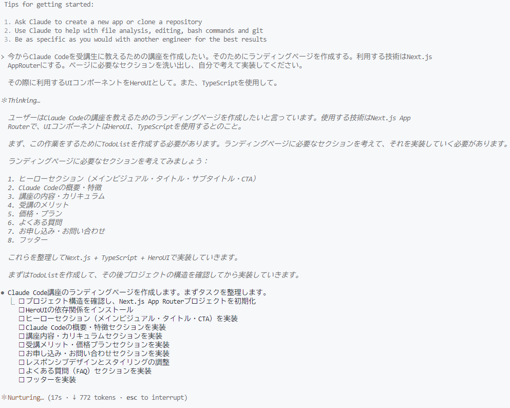
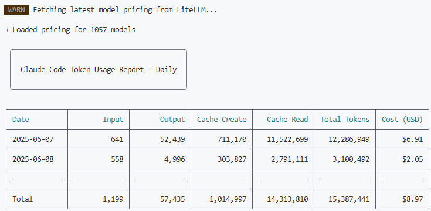

<abbr title="Anthropic">Anthropic</abbr>からリリースされたClaude Codeを試してみた。<mark>Next.js</mark>でランディングページを作成する過程で感じたことや気づいたポイントを記録しておく。

## Claude Codeとは

Claude Codeは、<abbr title="Artificial Intelligence">AI</abbr>がコードを理解し、生成し、実際にプロジェクトを構築できるツールで、開発者の作業を大幅にサポートしてくれるターミナル型のAI開発環境である。

チャットベースでの指示により、プロジェクト構築からコードの生成、ビルド実行、デバッグ、Git操作まで一連の開発作業を行うことができる。

## 作成したサイト

実際に作成したサイトはこちら。<mark>Vercel</mark>でデプロイした。

https://claude-code-landing.vercel.app/

## 環境セットアップ

### WSLのセットアップ

> [!IMPORTANT]
> Windows環境では<abbr title="Windows Subsystem for Linux">WSL</abbr>上のみのサポートとなっているため、まず<abbr title="Windows Subsystem for Linux">WSL</abbr>を準備する必要がある。

```bash
wsl --install -d Ubuntu-24.04
```

### Node.jsのインストール

権限管理とバージョン管理の観点から、nvmを使用してNode.jsをインストールした。nvmを使うメリットは以下の通りである。

> [!TIP]
> 1. **sudo不要**: ユーザー権限でNode.jsの管理が可能
> 2. **バージョン管理**: 複数のNode.jsバージョンの簡単切り替え
> 3. **セキュリティ**: 管理者権限を使わないため安全
> 4. **開発効率**: 権限エラーを気にせず開発が可能

<abbr title="Windows Subsystem for Linux">WSL</abbr>環境で以下のコマンドを実行し、<abbr title="Node Version Manager">nvm</abbr>をインストールした。

```bash
# nvmのインストール
curl -o- https://raw.githubusercontent.com/nvm-sh/nvm/v0.40.3/install.sh | bash

# Node.jsのインストール
nvm install --lts
nvm use node
# -> Now using node v22.16.0 (npm v10.9.2)
```

### Claude Codeのインストール

```bash
npm install -g @anthropic-ai/claude-code
claude --version
```

> [!NOTE]
> インストール後、サブスクリプションプランである<mark>Proプラン</mark>を選択してセットアップを完了した。これまで<mark>Maxプラン</mark>のみだったが、<mark>Proプラン</mark>でも利用できるようになっていた！

## 実際の開発体験

### プロジェクトの開始

ターミナルは<mark>Cursor</mark>上で<mark>Ubuntu 24.04</mark>を立ち上げて使用した。

プロジェクトのディレクトリに移動してから`claude`コマンドを実行すると、そのディレクトリをベースとして作業が開始される。

```bash
cd path-to-dir
claude
```

Claude Codeが生成したコードや回答をCursorのコンテキストとして読み込ませることができるため、非常にシームレスな開発体験を得ることができた。

### 実装内容の指示

今回は以下のプロンプトでランディングページの作成を依頼した：

```
今からClaude Codeを受講生に教えるための講座を作成したい。そのためのランディングページを作成する。利用する技術はNext.js App Routerとする。ページに必要なセクションを洗い出し、自分で考えて実装してください。

その際に利用するUIコンポーネントはHeroUIとする。また、TypeScriptを使用してください。
```

### 開発プロセス

Claude Codeは以下のような流れで作業を進めた：

1. **要件分析**: ランディングページに必要なセクションの洗い出し
2. **技術選定**: <mark>Next.js App Router</mark> + <mark>HeroUI</mark> + <mark>TypeScript</mark>の構成
3. **プロジェクト構築**: 必要なファイルとディレクトリ構造の作成
4. **実装**: 各コンポーネントの作成
5. **エラー対応**: 発生したエラーの自律的な解決



### エラー対応

開発中にエラーが発生した際、Claude Codeは<abbr title="autonomous - 人の手を借りずに自動的に">自律的</abbr>にエラーログを読み込み、対応策を考え、解決してくれた。

### デザインの改善

初期実装後、よりモダンなデザインへの改善を依頼した：

```
よりモダンで洗練されたデザインにしてください。グラデーションやアニメーションなども充実させてください。
```

Claude Codeはデザインの要求に対しても適切に対応し、視覚効果やアニメーションを追加した洗練されたデザインに変更してくれた。

### パッケージの移行対応

<abbr title="User Interface">UI</abbr>ライブラリについて、Claude Codeに<mark>HeroUI</mark>から<mark>NextUI</mark>への移行を依頼してみた。

問題なく適切にパッケージを移行してくれた。パッケージ移行も自動的に対応できる点は非常に便利だった。

## 完成までの時間とコスト

総合的な作業時間は約<mark>1〜2時間</mark>ほどで、基本的なランディングページを作成することができた。

今回は<mark>Proプラン</mark>のため料金はかかっていないが、仮にプランに加入していない場合のコストを確認したいと思った。

そこで、非公式の[Claude Codeの使用料金を可視化する<abbr title="Command Line Interface">CLI</abbr>ツール「ccusage」](https://zenn.dev/ryoppippi/articles/6c9a8fe6629cd6)を使用した。



## 今後の展開

Claude Codeを使った開発は以下の点で可能性を感じた：

- **プロトタイプ作成の高速化**: アイデアを素早く形にできる
- **学習ツールとしての活用**: 実装パターンを学ぶのに適している  
- **デザインの試行錯誤**: 異なるデザインパターンを素早く試せる

## まとめと考察

今回は、Claude Codeを使って初めてVibe Coding（直感的で流れるような開発体験）を試してみた。微妙な余白の調整なども的確に汲み取ってくれ、バグを伝えれば<abbr title="autonomous - 人の手を借りずに自動的に">自律的に</abbr>対応してくれる点が印象的だった。

この体験を通じて、**コーディングは<abbr title="Artificial Intelligence">AI</abbr>、人間がレビュー**という開発体制がすぐそこに来ていることを実感した。

Claude Codeは特にプロトタイプ作成やアイデアの具現化における<abbr title="zero to one - アイデアから初期実装まで">0→1のフェーズ</abbr>において威力を発揮するため、まずは個人開発で積極的に取り入れていきたい。

ただし注意点もある。全く知識がないコードベースやフレームワークでは、セキュリティ上の問題点などを<abbr title="identify - 発見・特定すること">指摘できない</abbr>ため、本番リリースする際には十分な検証が必要だ。

今回はあまり馴染みのないNext.jsを使用したが、内部で何が行われているのかが分からない状況は<u>精神的に不安</u>を感じた。ここで基礎知識の重要性を改めて実感することとなった。

結論として、AIが生成したコードを<abbr title="integration and review - 統合と検証">統合・レビュー</abbr>する立場にある人間には、<abbr title="従来より高度な検証・評価能力">従来以上に高いレビュー力</abbr>が求められるのではないだろうか。基礎知識と豊富な経験の重要性は、AI時代においても変わらないということを強く実感した。

## 参考動画

<iframe src="https://www.youtube.com/embed/6kBbbPDg12U?si=n6PxIpjnndZRMKTB" title="【Claude Code入門】初心者OK！誰でも爆速でアプリ開発ができる時代になりました" frameborder="0" allow="accelerometer; autoplay; clipboard-write; encrypted-media; gyroscope; picture-in-picture; web-share" allowfullscreen></iframe>

## 参考資料

- [Claude Code 公式ドキュメント](https://docs.anthropic.com/ja/docs/claude-code/overview)
- [Claude CodeをWindows上で使う方法 - Zenn](https://zenn.dev/acntechjp/articles/eb5d6c8e71bfb9)
- [nvm - Node Version Manager](https://github.com/nvm-sh/nvm)
- [Claude Pro（$20）プランでゼロから始めるClaude Code - Zenn](https://zenn.dev/asap/articles/700168965fdb7b)
- [Claude Codeの使用料金を可視化するCLIツール「ccusage」を作った - Zenn](https://zenn.dev/ryoppippi/articles/6c9a8fe6629cd6)
