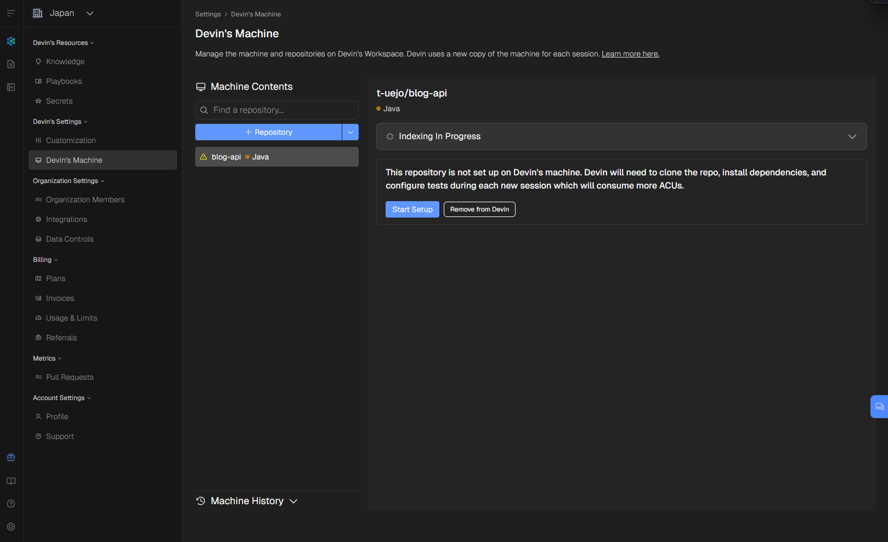
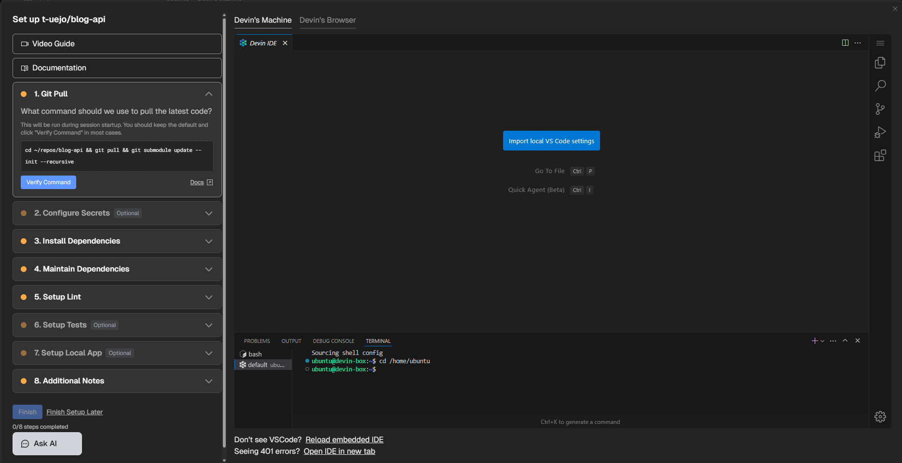
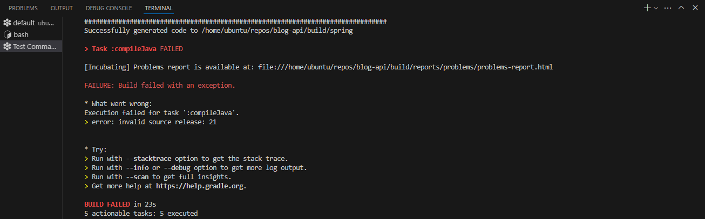
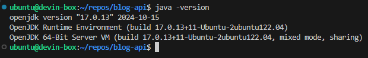
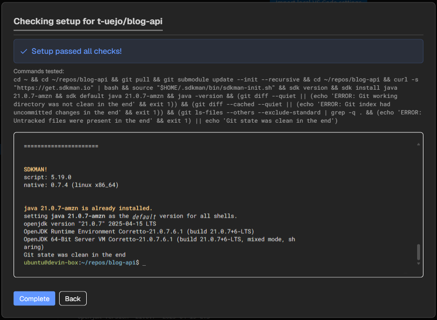
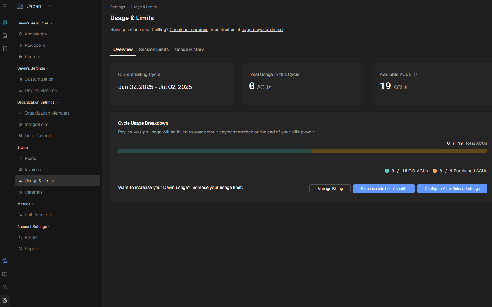

**Devin**を利用したので、セットアップ時にエラーや対応内容を記録しておく。

## そもそもなぜDevinを利用するのか

**Devin**を業務で使う可能性があり、どのような動作感なのかを把握するため。

- **インターフェースの違い**：SlackでDevinへ指示するユースケースが多いが、Webからでも問題なく利用できるのか
- **ドキュメント作成支援**：コードベースを理解してREADMEファイルをブラッシュアップできるか
- **バグ対応**：テストでエラーが起こっている状況を解決できるか

## 前提

言語とフレームワークは以下の通り。

- **Java 21**
- **Spring Boot**によるREST APIアプリ

詳細な技術スタックは以下を参照。

::github{repo="t-uejo/blog-api"}

<hr>

## Coreプラン契約とACUの追加取得

Devinの契約は**Coreプラン**で行った。

プロモーションコードがあると**10ACU**を追加取得することができた。以下のサイトを参考にした。

参考: [【2025年最新】Devin AIのプロモーションコード：最大200ドル分のクレジットを獲得する方法](https://hellocraftai.com/blog/1374/)

> [!IMPORTANT]
> 契約せずに10ACUはもらえない。

## マシンセットアップ

リポジトリを設定すると、自動的にマシンが準備され、**コードベースのインデックス化**が完了した。



**Start Setup**を押下し、以下の画面からセットアップを開始する。ここで少し待つと**Web IDE**が表示される。


### エディター環境

Devinでは**WebベースのIDE**が提供される。UIは**VSCode**と変わらない。



> [!NOTE]
> 初期設定では**JavaやDocker**がプリインストールされており、多くの開発ツールがすぐに利用可能な状態だった。

### Javaバージョンの課題と解決

プロジェクトのビルド時に**Javaバージョンの不一致でエラー**が発生した。



> [!IMPORTANT]
> Devinの仮想マシンには**Java 17**がプリインストールされているが、プロジェクトは**Java 21**を要求していた。（2025/06/02時点）



### Java 21への対応

以下のコマンドを実行して**Java 21**をインストールし、デフォルトに設定した：

```bash
cd ~/repos/blog-api && \
curl -s "https://get.sdkman.io" | bash && \
source "$HOME/.sdkman/bin/sdkman-init.sh" && \
sdk version && \
sdk install java 21.0.7-amzn && \
sdk default java 21.0.7-amzn && \
java -version
```

> [!TIP]
> **SDKMAN**を使用することで、複数のJavaバージョンを管理し、プロジェクトごとに適切なバージョンを使用できる。

## 環境セットアップの完了

**Java 21**の設定が完了し、プロジェクトが正常にビルドできるようになった。



> [!NOTE]
> 環境のセットアップ作業中は**ACUの消費がない**ことも確認できた。実際の**コーディング作業時のみACUが消費される**仕組みのようだ。



<hr>

## まとめと所感

Devinの初期設定を通じて感じたポイントは以下の通り。

- 多くの言語・フレームワークが**プリインストール**されているためセットアップが楽
- 初期設定のトライ&エラーでは**ACUが消費されない**
- **Coreプラン**なので、ACUは貴重に扱わないといけない。消費されること**への**危機感が常にある
- Web IDEからの利用でも問題なく利用できる。（ただし、日本語対応していない）